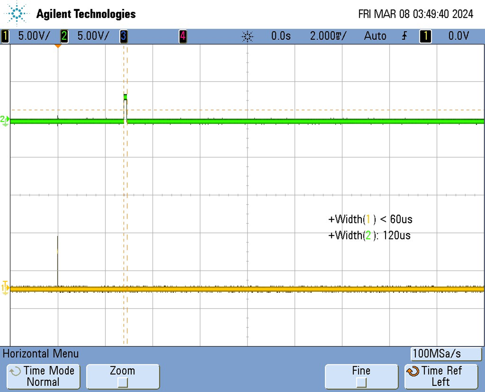

[](https://classroom.github.com/a/PmSEZ1rE)
# lab3_theremin_skeleton

    * Name: 
    * Github username: 
    * Github Repository URL: 
    * Description of hardware: (embedded hardware, laptop, etc) 

## Github Repo Submission Resources

* [ESE5160 Example Repo Submission](https://github.com/ese5160/example-repository-submission)
* [Markdown Guide: Basic Syntax](https://www.markdownguide.org/basic-syntax/)
* [Adobe free video to gif converter](https://www.adobe.com/express/feature/video/convert/video-to-gif)
* [Curated list of example READMEs](https://github.com/matiassingers/awesome-readme)
* [VS Code](https://code.visualstudio.com/) is heavily recommended to develop code and handle Git commits
  * Code formatting and extension recommendation files come with this repository.
  * Ctrl+Shift+V will render the README.md (maybe not the images though)

## Question 1

f = 2 * (16 MHz) / (1024 * 256) = 61.04 Hz

On the oscilloscope we see a frequency of 30.6 Hz; however, which is half of the frequency at which we fire an interrrupt. This is because it takes two interrupts for one cycle (on/off) of the D6 port. Our code uses an exclusive or, so after one interrupt pin D6 is high, after two pin D6 is low. Thus, it takes two interrupts to create one cycle on pin D6, which is why our oscillscope reads a frequency which is half the frequency of an interrupt.

## Question 2


## Question 3

I did prescale the timer by 256, mainly to ensure that the frequency of the the overflow was less than the frequency of the compare interrupt (since we can't set the OCR0A value to less more than 256).


## Question 4

When I precaled the timer by 256, the OCR0A was 71, calculated by this formula:

f_generated = (f_clock) / (2 * Prescaler * (1 + OCRnA))


## Question 5

```/*
 * PartB.c
 *
 * Created: 2/16/2024 2:20:23 PM
 * Author : jessijha
 */ 
#define F_CPU 16000000UL
#include <avr/io.h>
#include <avr/interrupt.h>
#include <util/delay.h>


void Initialize ()
{
	// Disable all global interrupts initially
	cli();
	
	//// Sets Normal Mode??
	//TIFR0 |= (1<<TOV0);
	
	// Set PB1 as output pin for the LED
	DDRD |= (1 << DDD6);
	//PORTD |= (1 << PORTD6);
	
	// Enables Timer 0 Overflow Interrupt
	TIMSK0 |= (1 << TOIE0);
	
	// Enables Timer 0 Compare Interrupt
	TIMSK0 |= (1 << OCIE0A);
	
	// Set clock source for Timer 0 with prescaler of 256
	TCCR0B |= (1 << CS02);
	
	// Uses the formula f_generated = (f_clock) / (2 * Prescaler * (1 + OCRnA))
	OCR0A = 71;

	// Enable all global interrupts
	sei();
}

//ISR(TIMER0_OVF_vect) {
	//// Play (new?) note every time the timer overflows
	//PORTD ^= (1 << PORTD6);
//}

ISR(TIMER0_COMPA_vect) {
	OCR0A += 71;
	PORTD ^= (1 << PORTD6);
}


int main(void)
{
	Initialize();
    while (1);
}  
```

## Question 6


## Question 7

The OCR0A value should be 71, which I calculated by using the formula: OCRnA = ((f_clock) / (2 * Prescaler * (f_desired)) - 1), where f_clock is 16 MHz, the Prescaler is 256, and f_desired is 440 Hz. 

## Question 8

```void Initialize ()
{
	// Disable all global interrupts initially
	cli();
	
	// Set PB1 as output pin for the LED
	DDRD |= (1 << DDD6);
	
	// Set clock source for Timer 0 with prescaler of 256
	TCCR0B |= (1 << CS02);
	
	// Set Timer 1 to CTC (Clear Timer on Compare Match)
	TCCR0A = (1 << WGM01);
	
	// Toggle OC1A on Compare Match
	TCCR0A |= (1 << COM0A0);
	
	// Uses the formula OCRnA = ((f_clock) / (2 * Prescaler * (f_desired)) - 1)
	OCR0A = 71;

	// Enable all global interrupts
	sei();
}


int main(void)
{
	Initialize();
	while (1);
}
```

## Question 9


## Question 10

The OCR0A value should be 35, which I calculated by using the formula: 2*OCRnA = (f_clock) / (2 * Prescaler * (f_desired), where f_clock is 16 MHz, the Prescaler is 256, and f_desired is 440 Hz. We have the extra 2 in the equation because the frequency on the oscilliscope is twice the PWM frequency (because of similar reasoning to the interrupts).

## Question 11

```
#define F_CPU 16000000UL
#include <avr/io.h>
#include <avr/interrupt.h>
#include <util/delay.h>
void Initialize ()
{
	// Disable all global interrupts initially
	cli();
	
	// Set PB1 as output pin for the LED
	DDRD |= (1 << DDD6);
	
	// Set clock source for Timer 0 with prescaler of 256
	TCCR0B |= (1 << CS02);
	
	// Set Timer 1 to PWM Phase Match
	TCCR0A |= (1 << WGM00);
	TCCR0B |= (1 << WGM02);
	
	// Toggle OC1A on Compare Match
	TCCR0A |= (1 << COM0A0);
	
	// Uses the formula OCRnA = ((f_clock) / (2 * Prescaler * (f_desired))
	OCR0A = 35;

	// Enable all global interrupts
	sei();
}


int main(void)
{
	Initialize();
	while (1);
}
```

## Question 12


## Question 13
The trigger needes to send a high pulse for at least 10us.

## Question 14
The trigger pin is used to send a high pulse, while the echo pin recieves signal that are reflected back by objects infront of the sensor.

## Question 15

2.47 cm

## Question 16



## Question 17

56.79 cm

## Question 18


## Question 19

| **Note**  | **C6** | **D6** | **E6** | **F6** | **G6** | **A6** | **B6** | **C7** |
|---------- |------- |------- |------- |------- |------- |------- |------- |------- |
| Freq (Hz) |  1046  |  1174  |  1318  |  1397  |  1568  |  1760  |  1975  |  2093  |
| OCR0A     |   29   |   26   |   23   |   22   |   19   |   17   |   15   |   14   |

## Question 20

OCR0A =  0.276*(SENSOR_VALUE) + 13.326

## Question 21

## Question 22

| **ADC Ranges**  | **Duty Cycle** |
|---------------- |--------------- |
| E.g. 0-100      | 5%             |
|                 | 10%            |
|                 | 15%            |
|                 | 20%            |
|                 | 25%            |
|                 | 30%            |
|                 | 35%            |
|                 | 40%            |
|                 | 45%            |
|                 | 50%            |

## Question 23

## Question 24

## Question 25

## Question 26

## Question 27
